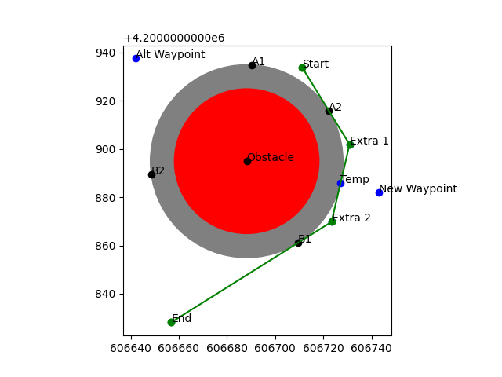
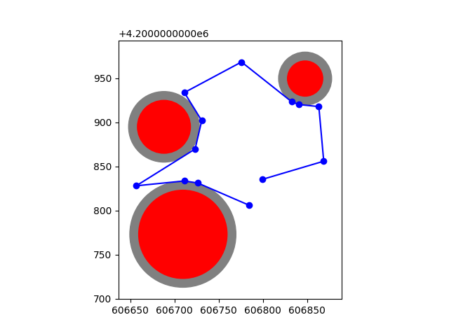
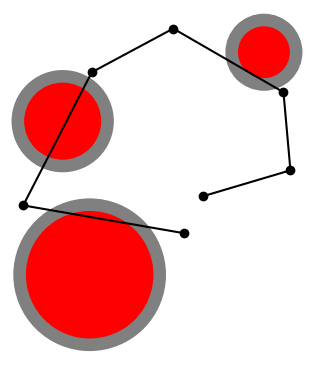

# Tangent Line Obstacle Avoidance

A basic obstacle avoidance algorithm that uses tangent lines to compute new waypoints around circular obstacles to generate a collision-free path. Algorithm requires a list of GPS waypoints and a list of circular GPS obstacles locations with radius information.

Originally written for the Multirotor Robot Design Team at Missouri S&T for the SUAS 2022 competition.

## Algorithm explanation

1. Each pair of points from beginning to end is checked for intersection with the obstacles.
2. If an intersection occurs, we generate tangent lines to either side of the circle for both the starting and ending points
3. The intersection of these lines are each potential new waypoints, and the one that is closer to the center of the circle is chosen as the new waypoint.
4. If the new waypoint is further than the `max_distance` parameter allows, a new pair of waypoints is generated that is tangent to the circle at the closest edge. This is best visualized in the debugging image below, where this parameter was set to 0.

## Usage

The `main.py` file contains example data and demonstrates the usage for running the algorithm. The main method is called `get_safe_route()` and takes the following parameters. 

The `padding` parameter is available to virtually increase the radius of the obstacles to allow for safe avoidance in case of GPS errors.

The `max_distance` parameter is used to determine how far away a generated waypoint can be before it should be broken down into two waypoints. This is used to solve the problem of the starting and ending waypoints being extremely close to the edge of the obstacle, and therefore resulting in tangent lines that intersect far off to the side. If more waypoints is not an issue, a value of 0 will result in creating a path that hugs the perimeter of the obstacle the closest.

```
get_safe_route(
    waypoints: list[dict],
    obstacles: list[dict],
    padding: float,
    max_distance: float,
    debugging: bool = False,
) -> list[dict]:
```

## Debugging

Setting the debugging parameter to True in the `get_safe_route()` method will result in generating a new graph with extra data for each pair of points with which a collision was detected that may be useful for understanding what the algorithm did when solving the final route. See example below:



## Results


